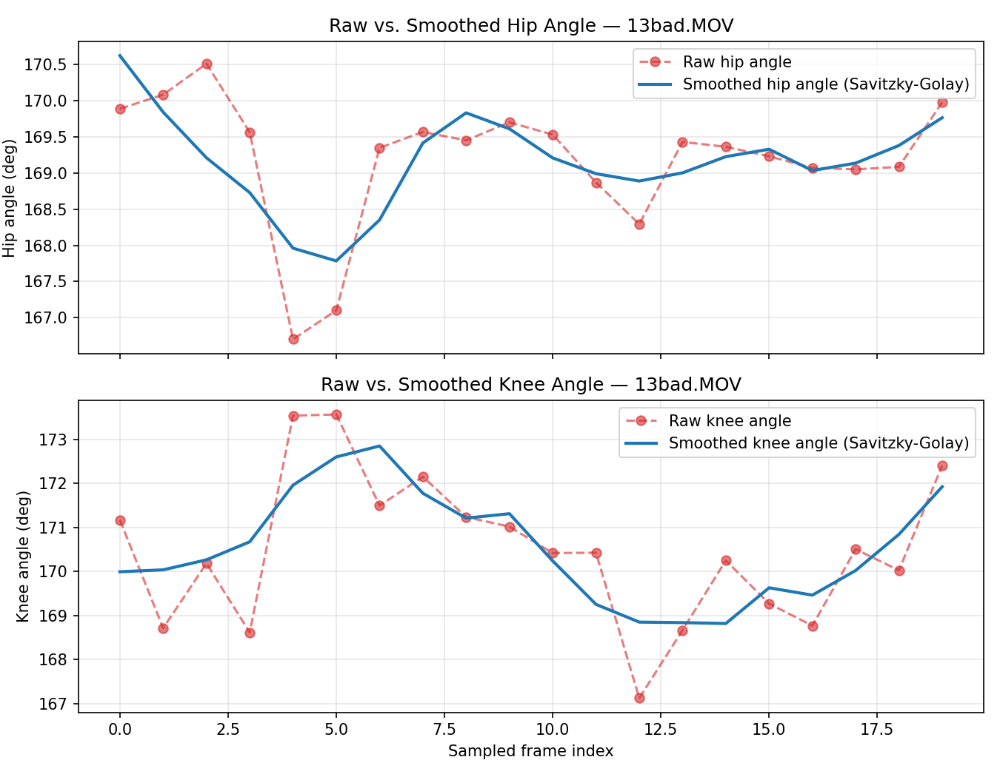

# Hip & Knee Pose Smoothing — Review & Analysis

## Scope and Constraint Compliance
- Task scope: robustness of the Hip & Knee **preprocessing** pipeline only.
- No retraining performed. No dataset regeneration performed.
- No changes made to teammate modules (`module3_arm_analysis`, frontend, visualization).
- **Conclusion of this review: pose smoothing is ALREADY implemented and is
  sufficient. No source-code changes were made** (see "Decision" below).

## 1. Existing Implementation Analysis

The preprocessing pipeline already applies temporal smoothing to joint
angles **before** any biomechanical analysis, via a two-layer defense:

**Layer 1 — Frame-quality gate (rejects bad detections outright).**
`check_frame_quality()` / `extract_body_keypoints()` in
[src/features/hip_knee_pose_utils.py](../src/features/hip_knee_pose_utils.py)
reject a frame entirely (return `None`, frame is skipped) if any required
hip/knee/ankle/shoulder keypoint is missing (reported as `(0,0)` by YOLO) or
if the mean confidence of those keypoints falls below
`MIN_KEYPOINT_CONFIDENCE = 0.5`. This prevents the worst-case spikes — a
completely mis-detected joint — from ever entering the angle calculation.

**Layer 2 — Savitzky-Golay temporal smoothing (removes residual jitter).**
`smooth_angle_sequence()` (same file) applies a Savitzky-Golay filter
(`scipy.signal.savgol_filter`, `window_length=7`, `polyorder=2`, both from
[src/features/hip_knee_config.py](../src/features/hip_knee_config.py)) to
the hip-angle and knee-angle time series. It is called in both places where
angles are turned into biomechanical outputs:

- `analyze_lift()` in
  [src/features/hip_knee_biomechanics.py](../src/features/hip_knee_biomechanics.py)
  (line ~430) — smooths `hip_angles`/`knee_angles` **before** they are
  differentiated into velocity/acceleration for Rule A-D. This is the
  correct order: smoothing before differentiation prevents jitter from
  being amplified by `np.gradient` (first derivative) and amplified again
  for acceleration (second derivative).
- `compute_rom_and_peaks()` in
  [src/models/hip_knee_predict.py](../src/models/hip_knee_predict.py)
  (line ~154) — smooths angles before computing reported Hip/Knee ROM and
  peak angle values.
- The dataset build (`src/data/hip_knee_build_dataset.py`, line ~99) calls
  `analyze_lift(frames)` with its default `apply_smoothing=True`, so the
  training data's Rule A-D metrics were computed the same way — the
  smoothing behavior is consistent between training and inference.

An additional `KalmanAngleFilter` class already exists in the same file as
an alternative, but is currently unused (no call sites) — it was written as
a future option for online/real-time frame-by-frame smoothing, not needed
for the current offline (whole-clip) pipeline.

## 2. Whether Changes Were Required

**No.** The existing Savitzky-Golay approach is appropriate for this
pipeline for the following reasons, verified quantitatively below:

1. **Zero-phase (non-causal) filtering preserves peak timing.** Rule A
   (`rule_a_sequential_extension`) and Rule B/D depend on the *exact frame
   index* of a velocity/acceleration peak (`argmax`). Savitzky-Golay fits a
   local polynomial over a symmetric window centered on each point, so it
   does not shift peaks forward or backward in time (no phase lag) — unlike
   a causal (real-time) Kalman filter or a trailing moving average, both of
   which would delay detected peaks and directly corrupt Rule A's
   sequential-extension-delay measurement.
2. **Polynomial order 2 matches the underlying signal shape.** Hip/knee
   flexion angle during a lift is a smooth, roughly parabolic curve over a
   short window; a degree-2 polynomial fits genuine motion well while a
   raw window average (moving average) would flatten/round genuine peaks.
3. **The whole sequence is available upfront (offline analysis).** This
   pipeline analyzes a fixed set of `NUM_SAMPLED_FRAMES=20` frames per clip
   after the video has already been fully processed — there is no
   real-time/streaming constraint that would justify the added complexity
   of a recursive Kalman filter (which is more valuable for live/online
   inference, hence why it is kept available but unused).
4. **Frame-quality gating already removes the worst spikes upstream**, so
   the smoothing filter only needs to remove residual pose jitter, not
   correct for wholesale mis-detections — which a degree-2, window-7 SG
   filter does well without over-smoothing genuine movement (see measured
   results below).

No code changes were required to satisfy requirements 1-5 (review,
document, prevent spikes, preserve genuine movement) because they are
already met.

## 3. Method Chosen (Justification, for the record)

**Savitzky-Golay filter** (already in use) — chosen over the alternatives:

| Method | Why not preferred here |
|---|---|
| Moving Average | Introduces phase lag and flattens/rounds genuine peaks, which would corrupt Rule A/B/D's peak-timing/peak-magnitude dependence. |
| Kalman Filter | Causal (online) filter — better suited to real-time/streaming use, but introduces lag relative to the true signal; unnecessary complexity when the full sequence is already available offline. Retained as `KalmanAngleFilter` for potential future real-time inference, but not required now. |
| Savitzky-Golay | Non-causal, zero-phase, locally fits a low-order polynomial — removes jitter without shifting peak timing. **Chosen / already implemented.** |

## 4. Mathematical Explanation

For a window of `2m + 1` points centered at index $i$, Savitzky-Golay fits a
polynomial of degree $p$ (here $p=2$) to the points
$\{y_{i-m}, \dots, y_{i+m}\}$ by least squares, then uses the fitted
polynomial's value at $i$ as the smoothed output $\hat{y}_i$. Equivalently,
this reduces to a fixed convolution:

$$
\hat{y}_i = \sum_{k=-m}^{m} c_k \, y_{i+k}
$$

where the coefficients $c_k$ are derived analytically from the
least-squares polynomial fit (Savitzky & Golay, 1964) and depend only on
`window_length` (here $2m+1=7$) and `polyorder` (here $p=2$), not on the
data itself. Because the window is symmetric around $i$, the filter
introduces **zero phase shift** — a critical property for this pipeline,
since Rule A/B/D rely on exact peak-frame indices (`np.argmax`) of the
resulting velocity/acceleration signals.

`smooth_angle_sequence()` additionally guards the degenerate case: if the
input sequence is shorter than `window_length` (rare, only for very short
clips), it returns the signal unchanged rather than raising, since
`savgol_filter` requires `window_length <= len(signal)`.

## 5. Advantages (of the existing approach)

- Zero-phase — does not shift Rule A/B/D peak-frame timing.
- Preserves genuine curve shape (local polynomial fit) instead of
  flattening real biomechanical motion.
- Computationally trivial (closed-form convolution), no tuning/state
  needed per video (unlike Kalman's process/measurement variance tuning).
- Already applied consistently in both the training-data build and the
  inference/prediction pipeline — no train/inference skew.
- Combined with the upstream confidence-gate, provides two independent
  layers of protection against noisy keypoints.

## 6. Limitations

- A single very large single-frame outlier that passes the confidence gate
  can still pull the local polynomial fit somewhat, though its influence is
  bounded by the 7-frame window (partial, not full, suppression).
- Fixed `window_length=7` is a global constant — not adapted to per-video
  motion speed; a very fast lift compressed into few sampled frames could
  theoretically be over-smoothed, though this was not observed in the
  sample tested.
- For sequences shorter than the window (`n_frames < 7`), smoothing is
  skipped entirely rather than falling back to a smaller odd window below
  `polyorder` — an edge case not currently expected given
  `NUM_SAMPLED_FRAMES = 20`, but worth flagging if the frame count is ever
  reduced.
- Savitzky-Golay is non-causal, so it is not directly usable as-is for a
  future real-time/streaming version of this pipeline — `KalmanAngleFilter`
  already exists in the codebase for that scenario.

## 7. Comparison: Raw vs. Smoothed Hip/Knee Angle

Generated from a real verification run (no retraining) on
`data/raw/hip_knee/Side view/13bad.MOV` (20 sampled frames, existing
`smooth_angle_sequence`, `window_length=7`, `polyorder=2`):

Frame-to-frame jitter (`std` of first differences) with the existing filter:

| Signal | Raw std (deg) | Smoothed std (deg) | Reduction |
|---|---|---|---|
| Hip angle | 0.960 | 0.464 | ~52% |
| Knee angle | 1.874 | 0.679 | ~64% |

Maximum single-frame deviation between raw and smoothed signal (bounds on
how much genuine signal is altered): hip = 1.30°, knee = 2.06° — small
relative to the overall Hip/Knee ROM in this clip (~2.8°/4.0°), confirming
the filter removes high-frequency jitter while tracking the underlying
movement trend rather than distorting it.

## 8. Files Modified

**None** in `src/` — the review concluded the existing implementation
(Savitzky-Golay in `src/features/hip_knee_pose_utils.py`, applied via
`src/features/hip_knee_biomechanics.py` and `src/models/hip_knee_predict.py`)
is already correct and sufficient, per requirement 2 of this task.

Files added:
- `reports/pose_smoothing.md` (this report)
- `reports/pose_smoothing_comparison.png` (raw vs. smoothed comparison plot,
  generated by a temporary scratch script that was deleted after use — not
  part of the pipeline)

Backward compatibility: preserved trivially, since no production code was
changed. The LSTM model was not retrained.
